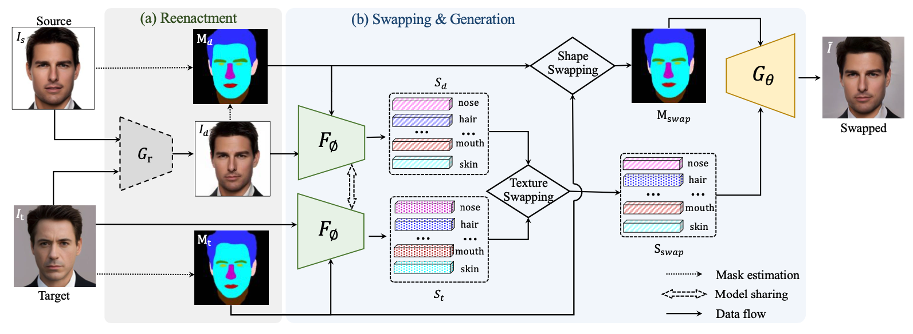

# E4S: Fine-grained Face Swapping via Regional GAN Inversion, CVPR 2023

<a href='https://arxiv.org/abs/2211.14068'></a> &nbsp;&nbsp;&nbsp;<a href='https://sadtalker.github.io'></a> &nbsp;&nbsp;&nbsp;[](#) &nbsp;&nbsp;&nbsp;


<a href="#">Zhian Liu<sup>1*</sup></a>&emsp;<a href="#">Maomao Li<sup>2*</sup></a>&emsp;<a href="https://yzhang2016.github.io">Yong Zhang<sup>2*</sup></a>&emsp;<a href="#">Cairong Wang<sup>3</sup></a>&emsp;<a href="https://qzhang-cv.github.io/">Qi Zhang<sup>2</sup></a>&emsp;<a href="https://juewang725.github.io/">Jue Wang<sup>2</sup></a>&emsp;<a href="https://nieyongwei.net/">Yongwei Nie<sup>1✉️</sup></a>

<sup>1</sup>South China University of Technology &emsp;
<sup>2</sup>Tencent AI Lab &emsp;
<sup>3</sup>Tsinghua Shenzhen International Graduate School<br>
*: equal contributions, &emsp; ✉️: corresponding author




<b>TL;DR: A face swapping method from fine-grained face editing perspective, realized by texture and shape extraction and swapping for each facial region.</b>


## 🧑‍💻 Changelog

  - __[2023.03.29]__: E4S repository initialized.

  - __[2023.02.28]__: E4S has been accepted by CVPR 2023!

___

## <details><summary>1. Installation</summary>

### 1.1 Env

### 1.2 Dependency

</details>


## <details><summary>2. Inference Demo</summary>

### 2.1 face swapping 

### 2.2 face editing 

</details>

## <details><summary>3. Train </summary>

### 3.1 dataset

### 3.2 training

</details>


## 🔗 Citation
If you find our work useful in your research, please consider citing:
```
@article{liu2022fine,
  title={Fine-Grained Face Swapping via Regional GAN Inversion},
  author={Liu, Zhian and Li, Maomao and Zhang, Yong and Wang, Cairong and Zhang, Qi and Wang, Jue and Nie, Yongwei},
  journal={arXiv preprint arXiv:2211.14068},
  year={2022}
}
```


## 🌟 Ackowledgements

Code borrows heavily from [PSP](https://github.com/eladrich/pixel2style2pixel), [SEAN](https://github.com/ZPdesu/SEAN). We thank the authors for sharing their wonderful codebase.

