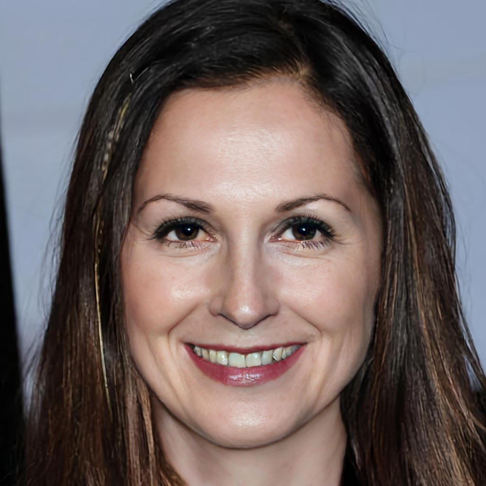
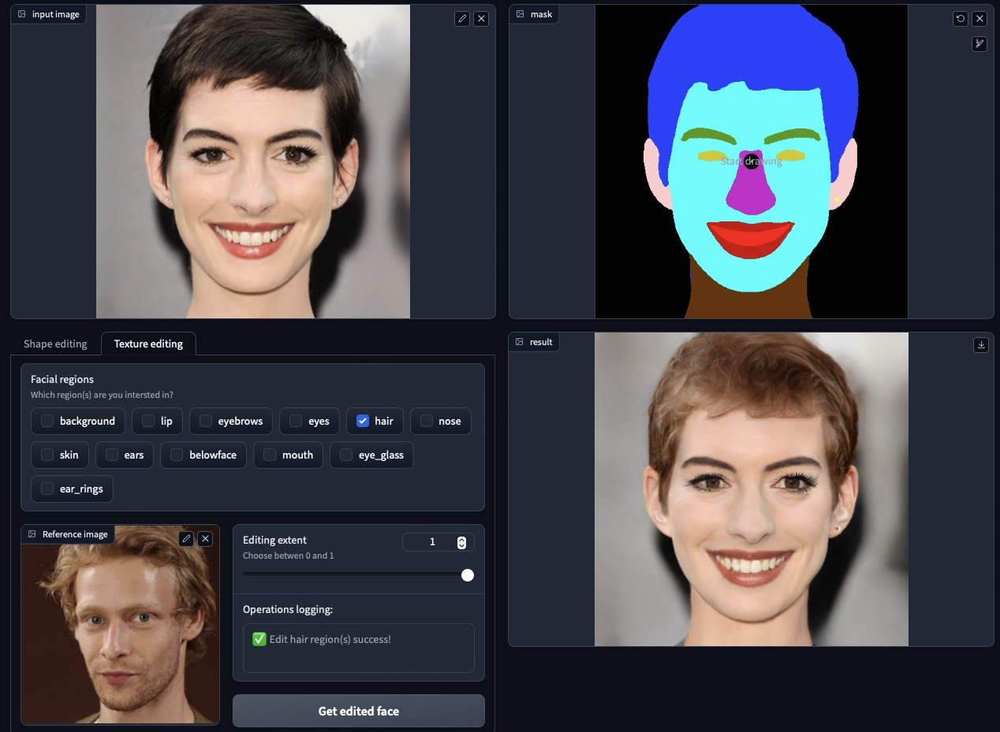

# E4S: Fine-grained Face Swapping via Regional GAN Inversion, CVPR 2023

<a href='https://arxiv.org/abs/2211.14068'></a> &nbsp;&nbsp;&nbsp;<a href='https://e4s2022.github.io'></a> &nbsp;&nbsp;&nbsp; 
[](https://huggingface.co/Zhian) &nbsp;&nbsp;&nbsp; 

 

[](https://huggingface.co/spaces/PAIR/PAIR-Diffusion)


<a href="#">Zhian Liu<sup>1*</sup></a>&emsp;<a href="#">Maomao Li<sup>2*</sup></a>&emsp;<a href="https://yzhang2016.github.io">Yong Zhang<sup>2*</sup></a>&emsp;<a href="#">Cairong Wang<sup>3</sup></a>&emsp;<a href="https://qzhang-cv.github.io/">Qi Zhang<sup>2</sup></a>&emsp;<a href="https://juewang725.github.io/">Jue Wang<sup>2</sup></a>&emsp;<a href="https://nieyongwei.net/">Yongwei Nie<sup>1✉️</sup></a>

<sup>1</sup>South China University of Technology &emsp;
<sup>2</sup>Tencent AI Lab &emsp;
<sup>3</sup>Tsinghua Shenzhen International Graduate School<br>
*: equal contributions, &emsp; ✉️: corresponding author


<b>TL;DR: A face swapping method from fine-grained face editing perspective, realized by texture and shape extraction and swapping for each facial region.</b>


## 🧑‍💻 Changelog
  - __[2023.05.10]__: Add multi-band blending as #5. 

  - __[2023.04.19]__: Add training and optimization script. 

  - __[2023.04.16]__: Add face editing inference demo. 

  - __[2023.04.11]__: Add face swapping inference demo (continue updating). 

  - __[2023.03.29]__: E4S repository initialized.

  - __[2023.02.28]__: E4S has been accepted by CVPR 2023!

___

# Usage
## 1. Installation
Please check the [installation Doc](./INSTALLATION.md) for the guidance.

## 2. Inference Demo

### 2.1 face swapping 
#### Face swapping in defult settings:
```sh
python scripts/face_swap.py --source=example/input/faceswap/source.jpg --target=example/input/faceswap/target.jpg
```
The reuslts will be saved to `example/output/faceswap` folder. Left to right: source, target, swapped face




You can optionally provide the face parsing result of the target image via `--target_mask` arg, and turn on the `--verbose=True` for detailed visulization. The results will be saved in the `--output_dir` folder (default to `example/output/faceswap`). 
```sh
python scripts/face_swap.py \
      --source=./example/input/faceswap/source.jpg \
      --target=./example/input/faceswap/target.jpg \
      --target_mask=./example/input/faceswap/target_mask.png \
      --verbose=True
```
It's recommanded to turn on `--lap_bld` for better result around the face boundary. For more information and supported args, run `python scripts/face_swap.py -h` for help.

### 2.2 face editing 
For texture related editting or interpolation, run 
```sh
python scripts/face_edit.py \
      --source=./example/input/faceedit/source.jpg \
      --reference=./example/input/faceedit/reference.jpg \
      --region hair eyes \
      --alpha=1
```

The reuslts will be saved to `example/output/faceedit` folder. 




For shape related editing, we provide an interactive editing demo that was build upon graido, just run 
```sh
python demo/gradio_demo.py
```


TODO: 
- [ ] Share the gradio demo on Huggingface.
- [x] Privide the optimization script for better results.


## 3. Train

If you plan to train the model from scratch, you will need to do a bit more stuffs. Machine with multiple GPUs is recommanded for the training.

### 3.1 dataset
Please download the [CelebAMask-HQ](https://github.com/switchablenorms/CelebAMask-HQ)and [FFHQ](https://github.com/NVlabs/ffhq-dataset) dataset accordingly. For FFHQ datatset, we only use the [images1024x1024](https://drive.google.com/open?id=1tZUcXDBeOibC6jcMCtgRRz67pzrAHeHL)(~ 90GB disk space). We assume the datasets are linked to the `./data` folder.

- CelebAMask-HQ

Make a soft link via `ln -s <donwloaded_CelebAMaskHQ_path> ./data/CelebAMaskHQ`. The RGB images and corresponding facial segmentations are already provided, make sure the folders `./data/CelebAMask-HQ/CelebA-HQ-img` and `./data/CelebAMask-HQ/CelebA-HQ-mask` exist.

- FFHQ

Make a soft link via `ln -s <donwloaded_FFHQ_path> ./data/FFHQ`. Since the facial segmentations are not provided, run `sh scripts/prepare_FFHQ.sh` for the esitimation (will cost some time). After processing, the directory should be:
```
data/FFHQ
├── ffhq_list.txt
├── images1024
│   └── 00000
│       ├── 00000.png
│       ├── 00001.png
|       ├── XXXXX.png
│   └── 01000
│       ├── 01000.png
│       ├── 01001.png
|       ├── XXXXX.png
│   ...
├── BiSeNet_mask
│   └── 00000
│       ├── 00000.png
│       ├── 00001.png
|       ├── XXXXX.png
│   └── 01000
│       ├── 01000.png
│       ├── 01001.png
|       ├── XXXXX.png
│   ...
```

### 3.2 pre-trained models

- StyleGANv2: [paper](https://arxiv.org/abs/1912.04958) | [code](https://github.com/rosinality/stylegan2-pytorch)

Please download the pre-trained ckpt(364M) [here](https://drive.google.com/file/d/1EM87UquaoQmk17Q8d5kYIAHqu0dkYqdT/view), and put it in the `pretrained_ckpts/stylegan2` folder.

- Auxiliary models

We utilitize a pre-trained IR-SE50 model during training to calculate the identity loss, which is taken from [TreB1eN](https://github.com/TreB1eN/InsightFace_Pytorch) repo. Please download it [here](https://drive.google.com/file/d/1KW7bjndL3QG3sxBbZxreGHigcCCpsDgn/view)  accordingly from the following table and put them in the `pretrained_ckpts/auxiliary` folder.

<!-- | Model    | Description |
| -        | -           |
| February | $80     |
| March    | $420    | -->

### 3.3 training script

Training on FFHQ in default 8 GPUs A100 settings: 
```sh
python  -m torch.distributed.launch \
        --nproc_per_node=8 \
        --nnodes=1 \
        --node_rank=0 \
        --master_addr=localhost \
        --master_port=22222 \
        scripts/train.py
```
It takes around 2 days to finish the training with 300K iters, batch size = 2 for each GPU. For more information and supported args, run ` python scripts/train.py -h` for help.


## 4. Optimization
For a specific face, applying an optimization stage would always produce better texture code, run:
```sh
python scripts/optimization.py --save_intermediate --verbose 
```

The optimzed texture code and the intermediate visulization results will be saved at `/work_dir/optim`, i.e., `--output_dir` option. Please feel free to change the step number of optimization, i.e.,`--W_steps`.

You can also specify your pre-trained RGI model via `--checkpoint_path` option, which is set to `./pretrained_ckpts/e4s/iteration_30000.pt` by default.


## 🔗 Citation
If you find our work useful in your research, please consider citing:
```
@article{liu2022fine,
  title={Fine-Grained Face Swapping via Regional GAN Inversion},
  author={Liu, Zhian and Li, Maomao and Zhang, Yong and Wang, Cairong and Zhang, Qi and Wang, Jue and Nie, Yongwei},
  journal={arXiv preprint arXiv:2211.14068},
  year={2022}
}
```


## 🌟 Ackowledgements

Code borrows heavily from [PSP](https://github.com/eladrich/pixel2style2pixel), [SEAN](https://github.com/ZPdesu/SEAN). We thank the authors for sharing their wonderful codebase.

<!-- ### Related repositories: -->
